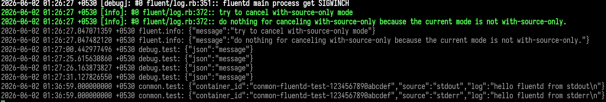

# poc for fluentd logging driver support in Conmon

# 1.) what

<figure>
  
  <figcaption>figure 1: last two lines of the log shows logs collected by fluentd via conmon</figcaption>
</figure>


Podman does not accept `fluentd` as a valid log driver yet. But this can be made possible. For my poc I test conmon directly with an OCI container run via `runc`.

1. Before running a container ensure fluentd collector is listening for logs on host,
``` bash
fluentd -c ./fluent/fluent.conf -vv
```

2. Create scratch dir for container stuff
```bash
TESTDIR=/tmp/conmon-fluentd-direct
```
3. Compile new Conmon binary with the poc code,
```bash 
CONMON=/home/jaitjacob/Documents/workbench/conmon/bin/conmon
CID=conmon-fluentd-test-1234567890abcdef
cd "$TESTDIR"
```

```bash
"$CONMON" \
  --cid "$CID" \
  --cuuid "$CID" \
  --runtime "$(command -v runc)" \
  --bundle "$TESTDIR" \
  --socket-dir-path "$TESTDIR" \
  --container-pidfile "$TESTDIR/container.pid" \
  --conmon-pidfile "$TESTDIR/conmon.pid" \
  --log-path fluentd:tcp://127.0.0.1:24224 \
  --log-tag conmon.test
```

# useful commands

1. You can see in the image that there are `{"json":"message"}` logs that is shown. I used `fluent-cat` command to do that. Helps to check if fluentd is running and setup correctly,

```bash
$ echo '{"json":"message"}' | fluent-cat
```
or with a routing tag assigned to the data(useful for matching filters and o/p rules)
```bash
$ echo '{"json":"message"}' | fluent-cat debug.test
```

>Note: This is a dump of things I want to refer back to as I come up with a production suited solution.